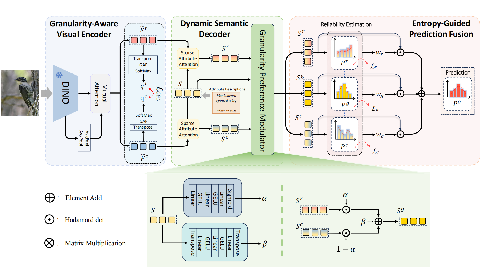

<div align="center">
  <h1> 🔍 ZeroDINO</h1>
  <p><em>ZeroDINO: Entropy-Driven Granularity-Aware Semantic Fusion for Zero-Shot Learning</em></p>
</div>

---

#  🧠 Model Architecture



# 🚀 Quick Start
Before you begin, please make sure you have downloaded the following datasets:

- 🐦 **[CUB-200-2011](http://www.vision.caltech.edu/visipedia/CUB-200-2011.html)**
- 🌞 **[SUN Attribute](https://groups.csail.mit.edu/vision/SUN/hierarchy.html)**
- 🐘 **[AWA2](https://cvml.ist.ac.at/AwA2/)**


### ✅ 1. Install Dependencies

Install all required Python packages:

```bash
pip install -r requirements.txt
```

### ✅ 2. Train or Evaluate 

Train on a specific dataset:

```bash
bash train.sh CUB      # or SUN / AWA2
```

Evaluate using pretrained weights:

```bash
bash test.sh CUB      # or SUN / AWA2
```

# 📈 Results

Performance of our released models on three benchmark datasets under two evaluation protocols: Conventional Zero-Shot Learning (CZSL) and Generalized Zero-Shot Learning (GZSL).

| Dataset | Acc (CZSL) | Unseen (GZSL) | Seen (GZSL) | Harmonic Mean (H) |
|:-------:|:----------:|:-------------:|:-----------:|:-----------------:|
| **CUB** |    86.6    |     78.3      |    82.7     |       80.4        |
| **SUN** |    79.3    |     57.1      |    52.0     |       54.4        |
| **AWA2**|    73.9    |     66.1      |    86.9     |       75.1        |


